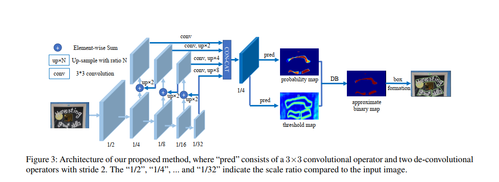
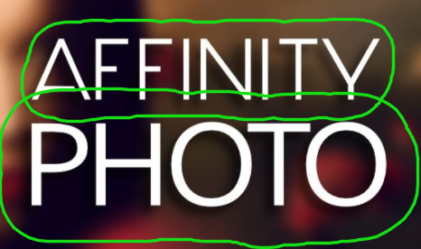
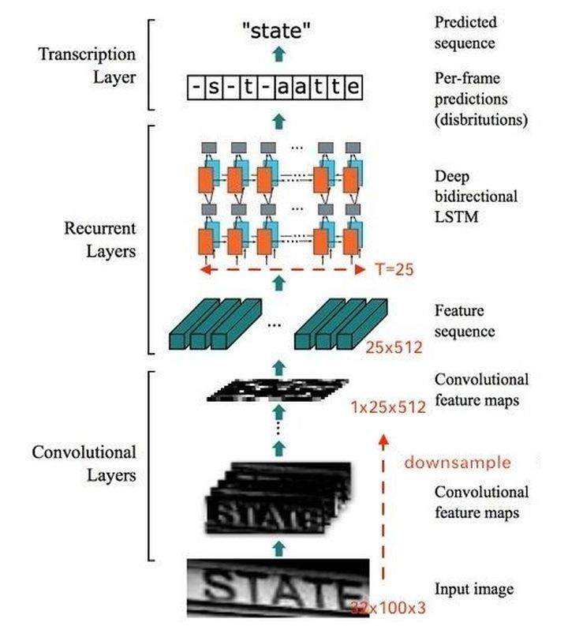
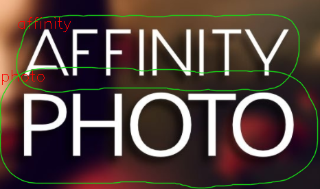

## [旭日x3]  一文实现OCR检测、识别

### 1、前言

文本检测识别是CV方向经典的任务之一，主要包括两个步骤，文本框的检测以及字符识别，本文将会在x3上分别实现如下三个部分,文本检测、字符识别、文本检测+字符符识别供大家选择,提供了onnxruntime和pytorch代码部署代码，同时也是第一次在x3上使用灰度图作为模型的输入，量化中配置文件和数据集准备也会一并给出。

文本检测模型采用的是dbnet:https://github.com/SURFZJY/Real-time-Text-Detection-DBNet

字符识别模型采用的是crnn:https://github.com/meijieru/crnn.pytorch

本文测试代码地址:https://github.com/Rex-LK/ai_arm_learning

本项目源码以及模型见百度云链接: https://pan.baidu.com/s/12tqW79RFfg94ccPheoTzsQ?pwd=xz8p 提取码: xz8p,文件为ai_arm_learning_1210

### 2、dbnet文本检测

2.1、模型简介

dbnet是一种广泛用于文本检测的模型，其本质是一个分割模型，最终会将图片上的文本区域分割出来，其模型结构如下:



2.2、模型量化

- 导出onnx

  在x3/ocr/dbnet/predict.py 里面提供了导出onnx模型的代码。

- 导出bin

​		dbnet的量化过程与常见的量化过程一致,配置文件如下:

```ymal
model_parameters:
  onnx_model: 'dbnet_simp.onnx'
  output_model_file_prefix: 'dbnet_simp'
  march: 'bernoulli2'
input_parameters:
  input_type_train: 'rgb'
  input_layout_train: 'NCHW'
  # 'rgb' / 'nv12' / yuv444 / 'bgr'
  input_type_rt: 'nv12'
  norm_type: 'data_scale'
  scale_value: 0.003921568627451
  input_layout_rt: 'NHWC'
calibration_parameters:
  cal_data_dir: './calibration_data_yuv_f32'
  calibration_type: 'max'
  max_percentile: 0.9999
compiler_parameters:
  compile_mode: 'latency'
  optimize_level: 'O3'
  debug: False
  core_num: 2 
```

2.3、dbnet测试代码

onnxruntime的测试代码为x3/ocr/dbnet/infer_onnxruntime.py，下面为推理的代码,

```python
    def predict(self, img, d_size = (640,640), min_area: int = 100):
        img0_h,img0_w = img.shape[:2]
        img = cv2.cvtColor(img, cv2.COLOR_BGR2RGB)
        # 图片预处理
        img = cv2.resize(img,d_size)
        img = img / 255
        img = img.astype(np.flo其中绿色的封闭曲线为dbnet识别到的文本框区域。

3、crnn字符识别at32)
        img = img.transpose(2,0,1)
        img = np.ascontiguousarray(img)
        img = img[None, ...]
        preds = self.model.run(["output"], {"image": img})[0]
        preds = torch.from_numpy(preds[0])
        scale = (preds.shape[2] / img0_w, preds.shape[1] / img0_h)
        start = time.time()
        prob_map, thres_map = preds[0], preds[1]
        out = (prob_map > self.thr).float() * 255
        out = out.data.cpu().numpy().astype(np.uint8)
       	# 找文本框
        contours, hierarchy = cv2.findContours(out, cv2.RETR_EXTERNAL, cv2.CHAIN_APPROX_SIMPLE)
        contours = [(i / scale).astype(np.int) for i in contours if len(i)>=4] 
        dilated_polys = []
        for poly in contours:
            poly = poly[:,0,:]
            D_prime = cv2.contourArea(poly) * self.ratio_prime / cv2.arcLength(poly, True) # formula(10) in the thesis
            pco = pyclipper.PyclipperOffset()
            pco.AddPath(poly, pyclipper.JT_ROUND, pyclipper.ET_CLOSEDPOLYGON)
            dilated_poly = np.array(pco.Execute(D_prime))
            if dilated_poly.size == 0 or dilated_poly.dtype != np.int or len(dilated_poly) != 1:
                continue
            dilated_polys.append(dilated_poly)
        boxes_list = []
        for cnt in dilated_polys:
            if cv2.contourArea(cnt) < min_area:
                continue
            rect = cv2.minAreaRect(cnt)
            box = (cv2.boxPoints(rect)).astype(np.int)
            boxes_list.append(box) 
        t = time.time() - start
        boxes_list = np.array(boxes_list)
        return dilated_polys, boxes_list, t
```

2.4、 测试结果



其中绿色的封闭曲线为dbnet识别到的文本框区域。

### 3、crnn字符识别

3.1、模型简介

crnn是一种卷积循环神经网络，实现了CNN与LSTM的结合来提取图片特征,最后使用ctc解码来实现对文字的识别,模型结构如下:



3.2、模型量化

- 导出onnx

  x3/crnn/demo.py 里面提供了导出onnx模型的代码,与其他模型有一点不一样的地方是:crnn接受的是灰度图作为模型的输入，维度为[1,1,32,100]

- 准备灰度校准数据

  由于crnn的输入为灰度图像，那么需要对校准数据进行一点特殊的处理，下面为生成灰度校准数据的代码来自于:[[BPU部署教程] 一文带你轻松走出模型部署新手村](https://developer.horizon.ai/forumDetail/107952931390742029)

  ```python
  import os
  import cv2
  import numpy as np
  
  src_root = '../../../01_common/calibration_data/coco/'
  cal_img_num = 100  # 想要的图像个数
  dst_root = 'calibration_data'
  num_count = 0
  img_names = []
  for src_name in sorted(os.listdir(src_root)):
      if num_count > cal_img_num:
          break
      img_names.append(src_name)
      num_count += 1
  if not os.path.exists(dst_root):
      os.system('mkdir {0}'.format(dst_root))
  def imequalresize(img, target_size, pad_value=127.):
      target_w, target_h = target_size
      image_h, image_w = img.shape[:2]
      img_channel = 3 if len(img.shape) > 2 else 1
      scale = min(target_w * 1.0 / image_w, target_h * 1.0 / image_h)
      new_h, new_w = int(scale * image_h), int(scale * image_w)
  
      resize_image = cv2.resize(img, (new_w, new_h))
      pad_image = np.full(shape=[target_h, target_w, img_channel], fill_value=pad_value)
      dw, dh = (target_w - new_w) // 2, (target_h - new_h) // 2
      pad_image[dh:new_h + dh, dw:new_w + dw, :] = resize_image
      return pad_image
  for each_imgname in img_names:
      img_path = os.path.join(src_root, each_imgname)
      img = cv2.imread(img_path)  # BRG, HWC
      img = cv2.cvtColor(img, cv2.COLOR_BGR2RGB)  # RGB, HWC
      img = imequalresize(img, (100, 32))
      img = img.astype(np.uint8)
      img = cv2.cvtColor(img,cv2.COLOR_RGB2GRAY)
      dst_path = os.path.join(dst_root, each_imgname + '.rgbchw')
      print("write:%s" % dst_path)
      img.astype(np.uint8).tofile(dst_path) 
  print('finish')
  ```

- 配置文件

  需要修改模型的输入的格式,配置文件如下:

  ```ymal
  model_parameters:
    onnx_model: 'crnn_simp.onnx'
    output_model_file_prefix: 'crnn_simp'
    march: 'bernoulli2'
  input_parameters:
    input_type_train: 'gray'
    input_layout_train: 'NCHW'
    # 'rgb' / 'nv12' / yuv444 / 'bgr'
    input_type_rt: 'gray'
    norm_type: 'data_scale'
    scale_value: 0.0078125
    input_layout_rt: 'NHWC'
  calibration_parameters:
    cal_data_dir: './calibration_data'
    calibration_type: 'max'
    max_percentile: 0.9999
  compiler_parameters:
    compile_mode: 'latency'
    optimize_level: 'O3'
    debug: False
    core_num: 2
  ```

3.3、crnn测试代码

crnn测试文件为x3/ocr/crnn/infer_onnxruntime.py

```python
    def predict(self,img):
    	# 灰度
        image_input = self.preprocess_gray(img,(100,32))
        print(image_input.shape)
        preds = self.model.run(["output"], {"image": image_input})[0]
        preds = torch.from_numpy(preds)
        _, preds = preds.max(2)
        preds = preds.transpose(1, 0).contiguous().view(-1)
        preds_size = Variable(torch.IntTensor([preds.size(0)]))
        raw_pred = self.converter.decode(preds.data, preds_size.data, raw=True)
        sim_pred = self.converter.decode(preds.data, preds_size.data, raw=False)
        return raw_pred,sim_pred
```

### 4、文本检测+字符识别

4.1 识别流程

在实际项目过程中,文本检测和字符识别两个流程经常是绑定在一起的,首先通过文本检测模型找到文本区域,然后利用crnn对文本区域里面的内容进行识别,下面会通过一个简单的例子来实现这个过程。

4.2 测试代码

以x3测试代码为例:x3/ocr/demo_x3.py

```python
	dbnet = dbnet_model(args.dbnet_path) 
    # 该repo的crnn可以识别 数字以及字母
    alphabet = '0123456789abcdefghijklmnopqrstuvwxyz'
    converter = strLabelConverter(alphabet)   
    crnn = crnn_model(args.crnn_path,converter)
    img0 = cv2.imread(args.image_path) 
    img_rec = img0.copy()
   	img0_h,img0_w = img0.shape[:2]
    # boxes_list 为所有文本框区域
    contours, boxes_list, t = dbnet.predict(img0)
    for i,box in enumerate(boxes_list):
        mask_t = np.zeros((img0_h, img0_w), dtype=np.uint8)
    	# 将某一个文本区域单独提取出来
        cv2.fillPoly(mask_t, [box], (255), 8, 0)
        pick_img = cv2.bitwise_and(img0, img0, mask=mask_t)
        x, y, w, h = cv2.boundingRect(box)
        crnn_infer_img =  pick_img[y:y+h,x:x+w,:]
        crnn_infer_img = cv2.cvtColor(crnn_infer_img,cv2.COLOR_BGR2GRAY)
        # crnn 识别
        raw_pred,sim_pred = crnn.predict(crnn_infer_img)
        print('%-20s => %-20s' % (raw_pred, sim_pred))
        if args.output_folder:
            cv2.putText(img_rec, sim_pred, (x,y+20), cv2.FONT_HERSHEY_SIMPLEX, 0.75, (0, 0, 255), 1)
    if args.output_folder:
        img_det = img0[:, :, ::-1]
        imgc = img_det.copy()
        cv2.drawContours(imgc, contours, -1, (22,222,22), 1, cv2.LINE_AA)
        cv2.imwrite(args.output_folder + '/contour.png', imgc)
        img_draw = draw_bbox(img_rec, boxes_list)
        cv2.imwrite(args.output_folder + '/predict.jpg', img_draw)
```

4.3 测试结果



从结果上看，dbnet能够准确的将文本区域预测出来，当然也可以通过调整dbnet的阈值来调整文本区域的大小，同时crnn能够很好的将文本区域的英文字母识别出来。

### 5、总结

本文将OCR算法里面的文本检测、字符识别中的一个模型在x3上进行实现，同时复习了之前研究过的一些算法，希望x3能够在更多领域发挥价值。


