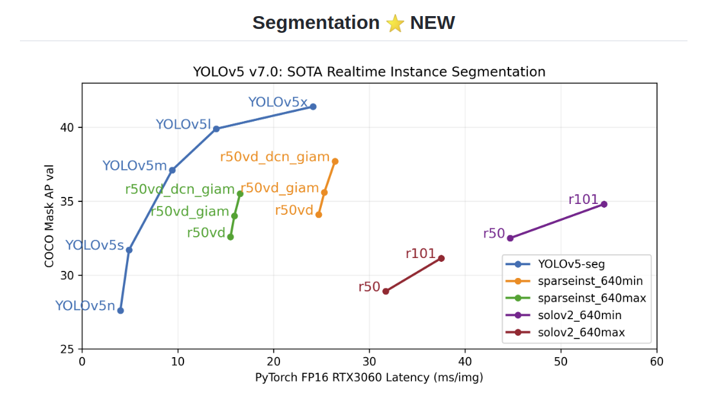
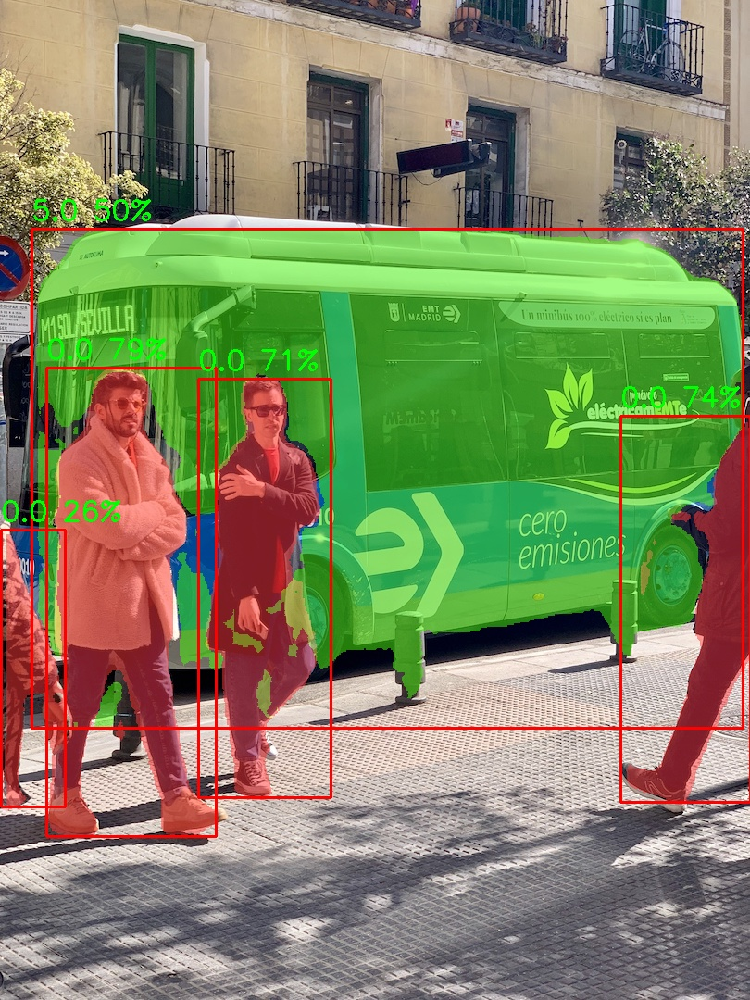

# [旭日x3] 动手实践之 yolov5-7.0 实例分割

### 1. 前言

实际上很早之前yolov5就发布了实例分割的版本，前几天更新到了yolov5-7.0版本，其中实例分割的速度与精度实在过于惊艳，其中实例分割的思想与yolact一致，于是便想先用python代码在x3上进行测试。

 

onnxruntime推理代码参考: https://blog.csdn.net/yangjinyi1314/article/details/127101492

yolact论文阅读代码:https://blog.csdn.net/qq_44690067/article/details/125774530?ops_request_misc=%257B%2522request%255Fid%2522%253A%2522166929849516800192258499%2522%252C%2522scm%2522%253A%252220140713.130102334..%2522%257D&request_id=166929849516800192258499&biz_id=0&utm_medium=distribute.pc_search_result.none-task-blog-2~all~top_click~default-2-125774530-null-null.142^v66^control,201^v3^control_1,213^v2^t3_esquery_v3&utm_term=yolact&spm=1018.2226.3001.4187

本文测试代码: https://github.com/Rex-LK/ai_arm_learning

### 2. 测试步骤

#### 2.1 onnx转bin

配置文件如下:

```
model_parameters:
  onnx_model: 'yolov5n-seg.onnx'
  output_model_file_prefix: 'yolov5n-seg'
  march: 'bernoulli2'
input_parameters:
  input_type_train: 'rgb'
  input_layout_train: 'NCHW'
  input_type_rt: 'nv12'
  norm_type: 'data_scale'
  scale_value: 0.003921568627451

  input_layout_rt: 'NHWC'
calibration_parameters:
  cal_data_dir: './calibration_data_rgb_f32'
  calibration_type: 'max'
  max_percentile: 0.9999
compiler_parameters:
  compile_mode: 'latency'  
  optimize_level: 'O3'
  debug: False
  core_num: 2
```

#### 2.2 run_x3.py

下面会对代码进行简要概述，详细的内容可以参考yolov5源码、onnxruntime推理代码、以及本文测试代码。

```
# 检测类
class Yolov5_7_Seg:
    ...
    def letterbox(self):
        # 进行填充黑边的resize
        ...
    def process_mask(self):
        # yolov5-seg 有两个输出 一个是 25200*117 的检测结果,每一行前85为检测结果，后32为掩码系数
        # 第二个输出为原型掩码，32 * 169 * 160，使用掩码系数对 原型掩码进行加权求和，就可以得到最终的mask
		...

if __name__ == "__main__":
    #  检测类
    v5_7_seg_detector = Yolov5_7_Seg(args.modelpath,
                                     conf_thres=args.confThreshold,
                                     iou_thres=args.nmsThreshold)
    # 进行检测
    prediction_out = v5_7_seg_detector.detect(image0)
    # 后处理
    final_mask, final_det = v5_7_seg_detector.postprocess(prediction_out)
    
        d_r = DRAW_RESULT(args.modelpath,
                      conf_thres=args.confThreshold,
                      iou_thres=args.nmsThreshold)
 	# 写结果
    colors_obj = Colors(
    )  # create instance for 'from utils.plots import colors'
    d_r.draw_mask(final_mask,
                  colors_=[colors_obj(x, True) for x in final_det[:, 5]],
                  im_src=image0)
 
    d_r.draw_detections(image0, final_det[:, :4], final_det[:, 4],
                        final_det[:, 5])
 
```

#### 2.3 实例分割结果



可以看到效果还是很不错的，这个结果是采用yolov5n模型进行测试，如果使用yolo5s、m、l等大模型精度会更高。

### 3. 总结

通过对yolov5-seg源码的学习，进一步了解到了yolov5实例分割的思想以及实现步骤，后续可能会对x3的cpp部署代码进行测试，tensort代码测试。由于cpp部署中出现了较多的矩阵乘法，有机会复习一下之前学到的cpp实现矩阵的实现，并应用在实际代码上。

