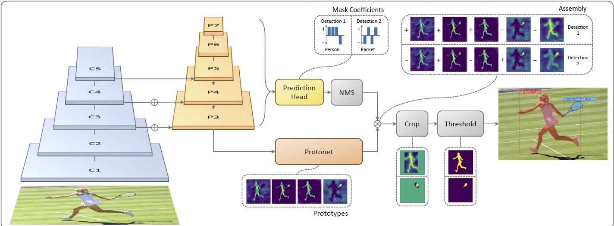
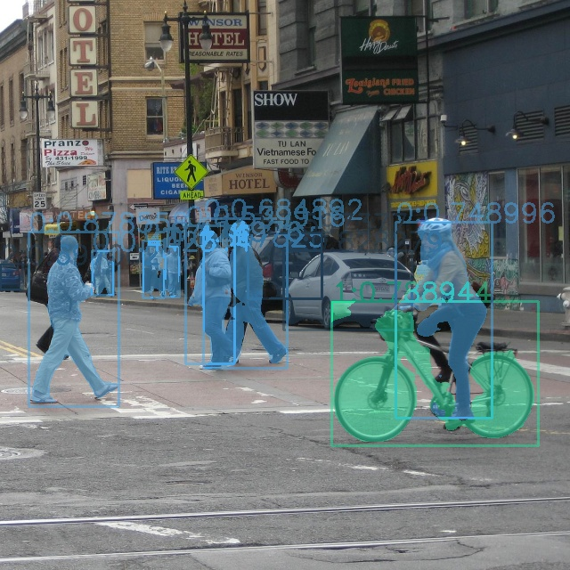

## [旭日3]  yolov5seg实例分割cpp部署代码
### 1. 前言
yolov5-7.0版本继续更新了实例分割的代码，其分割的精度与速度令人惊讶，本文将yolov5-seg模型在x3上允许，并利用矩阵操作的方法对进行部分后处理，同时针对模型有多个输出时，利用从cpp代码如何将分割与检测的代码分别取出来。

实例分割原理:[yolact](https://blog.csdn.net/wh8514/article/details/105520870/)

yolov5seg-cpp实现代码:[Yolov5-instance-seg-tensorrt](https://github.com/fish-kong/Yolov5-instance-seg-tensorrt)

cpp矩阵实现:[algorithm-cpp](https://github.com/shouxieai/algorithm-cpp)

本文测试代码:https://github.com/Rex-LK/tensorrt_learning/tree/main/trt_cpp/src/trt/demo-infer/yolov5seg
### 2. 实例分割结果
yolov5-seg的结果分为两部分，一个是检测的结果，维度为25200*177，前85列为每个检测框结果，后32列为每个检测框的mask系数，另外一个是分割结果:原型mask，维度为32 * 160 * 160，实例分割的后处理就是将目标框里面的mask系数与原型mask进行加权求和，从而获得实例分割的效果。
#### 2.1 检测结果后处理
通过置信度以及NMS可以挑选出最终的目标框，这个过程就不在过多的赘述了。
#### 2.2 实例分割分割结果后处理
实例分割的后处理过程其实是一个矩阵相乘的过程，因此基于。。。实现cpp矩阵，在这里实现了后处理，原作者的代码是用过利用opencv里面的Mat来表示一个矩阵，然后进行一些矩阵的操作，而本文实现在在自定义Matrix上进行矩阵操作。

```cpp
// 原型mask 32 * 160 * 160
float *seg_det = seg_out->cpu<float>();
vector<float> mask(seg_det, seg_det + segChannels * segWidth * segHeight);
// 矩阵表示
Matrix seg_proto(segChannels, segWidth * segHeight, mask);
for (int i = 0; i < box_result.size(); ++i) {
    // 可以将所有的mask系数放在一起，然后利用cuda进行加速计算

    // 每个目标框的mask系数 乘以原型mask 并取sigmod
    Matrix resSeg = (mygemm(box_result[i].mask_cofs,seg_proto).exp(-1) + 1.0).power(-1);
    
    Mat resMat(resSeg.data_);
    resMat = resMat.reshape(0,{segHeight,segWidth});
    // 如果图片预处理为直接resize,那么计算出来的resMat可以直接缩放回原图，
    // 如果是填充黑边的resize，可以参考原代码将原型mask恢复到原图大小
    resize(resMat, resMat, Size(INPUT_H,INPUT_W), INTER_NEAREST);
    // 获取原型mask里面目标框的区域
    Rect temp_rect = box_result[i].box;
    // 将目标框区域 大于0.5的值变为255
    cv::Mat binaryMat;
    inRange(resMat(temp_rect), 0.5, 1, binaryMat);
    box_result[i].boxMask = binaryMat;
    // cv::imwrite(to_string(i) + "_.jpg", b);
    }
```
下面为利用cpp实现的矩阵，可以实现一些简单的矩阵运算。
```cpp
class Matrix{
public:
    Matrix();
    Matrix(int rows, int cols, const std::initializer_list<float>& pdata={});
    Matrix(int rows, int cols, const std::vector<float>&v);
    
    const float& operator()(int irow, int icol)const {return data_[irow * cols_ + icol];}
    float& operator()(int irow, int icol){return data_[irow * cols_ + icol];}
    Matrix element_wise(const std::function<float(float)> &func) const;
    Matrix operator*(const Matrix &value) const;
    Matrix operator*(float value) const;
    Matrix operator+(float value) const;
    Matrix operator-(float value) const;
    Matrix operator/(float value) const;
    int rows() const{return rows_;}
    int cols() const{return cols_;}
    Matrix view(int rows, int cols) const;
    Matrix power(float y) const;
    float reduce_sum() const;
    float* ptr() const{return (float*)data_.data();}
    Matrix exp(float value);
public:
    int rows_ = 0;
    int cols_ = 0;
    std::vector<float> data_;
};
```
### 3. 测试
下载本代码

```shell
cd x3_inference
mkair build && cd build 
cmake .. && make -j
./seg_demo
```

测试结果如下:


### 4. 总结
本次学习了yolov5实例分割的原理以及代码，通过对比原理以及代码的步骤，弄清楚了yolov5是如何实现实例的分割任务的，如果本文对各位有用，麻烦点个star，同时了解到了bpu上如果有多输出的情况下的结果处理。